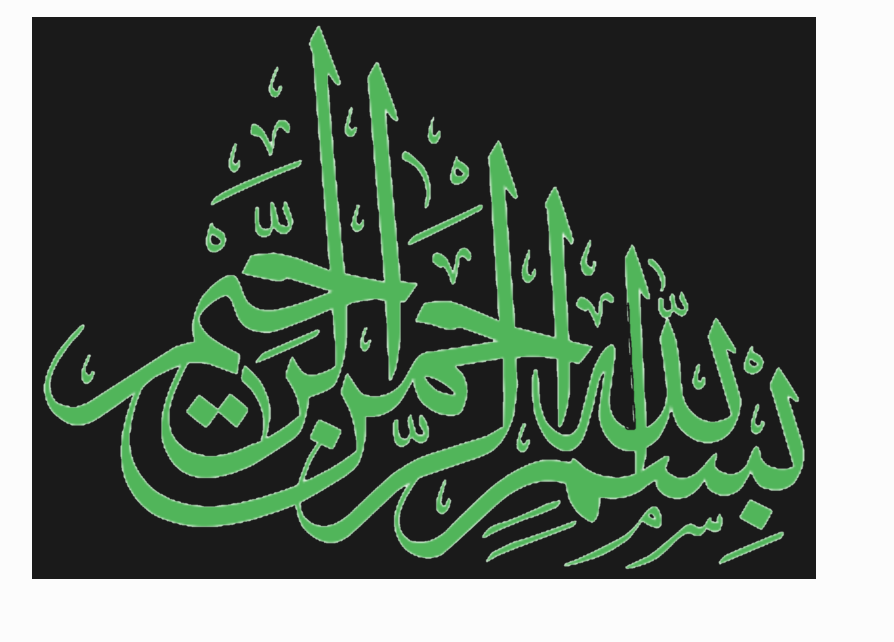
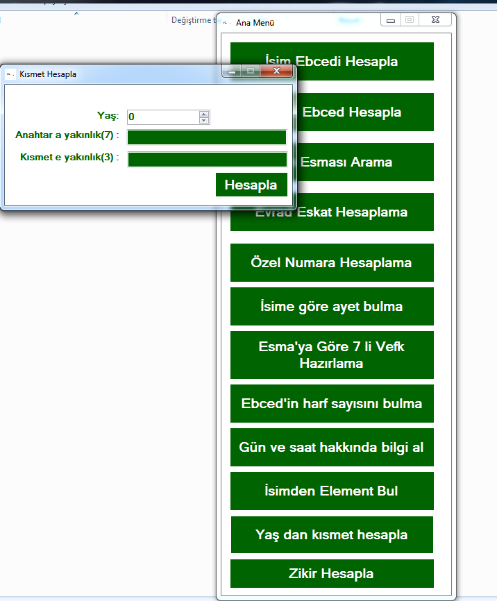
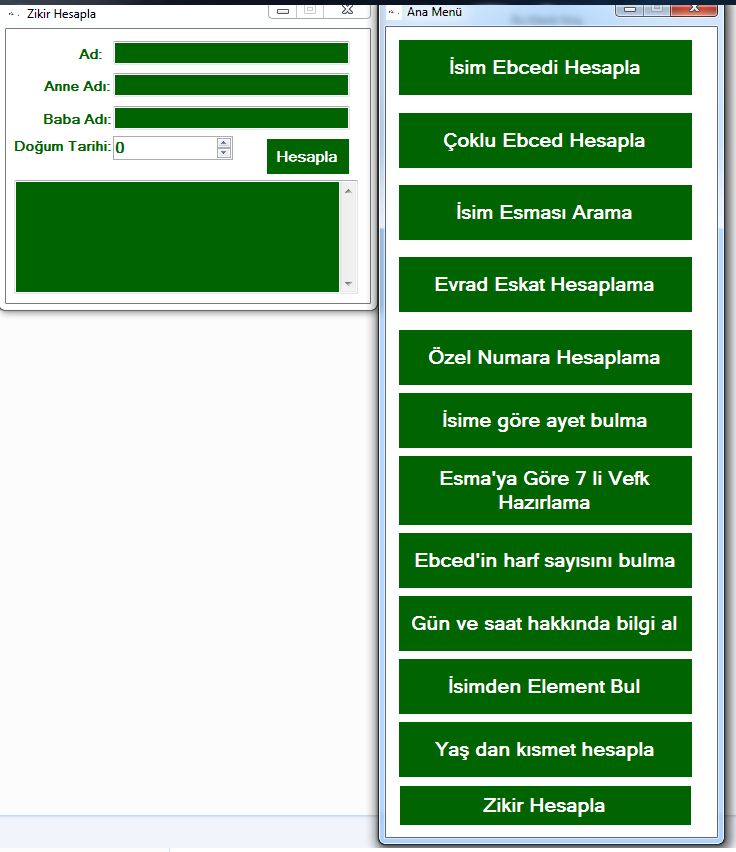
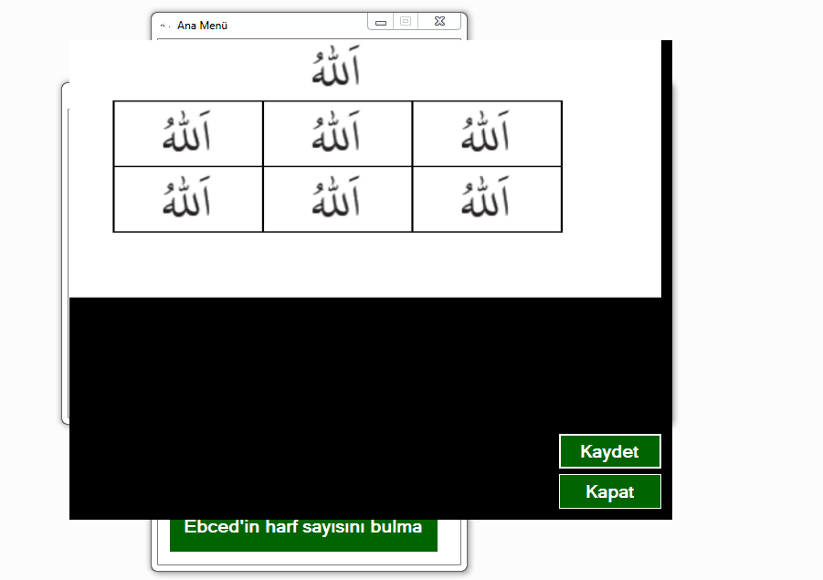
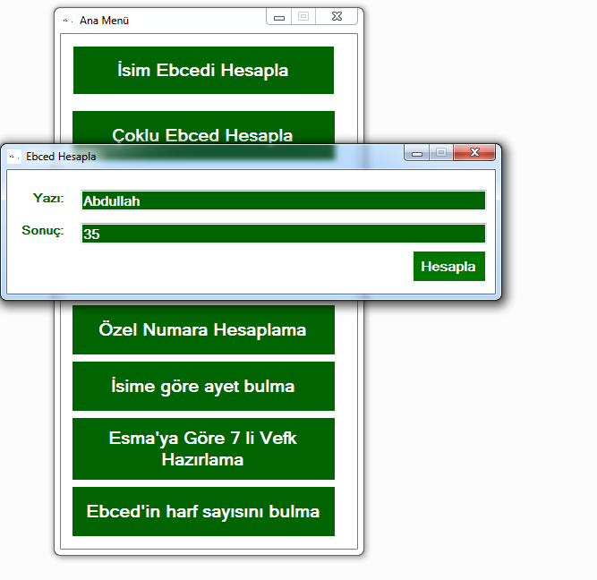
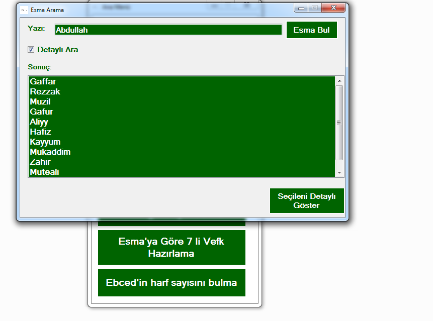
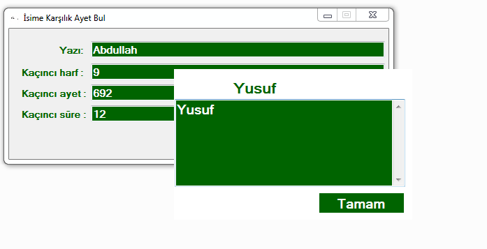

EbcedTurkishAlphabet

Açılış:

Bazı işlemler:

Kısa tanıtım:

Bu program dinimiz İslâm için hazırladığım programdır. 
Maksat Kur'an Kerim azimüşanı ve Allahuteâlâ'nın bizim için bahşettiği isimlerle ve hikmetli kelâmullahları daha derinlemesine incelemek için yapılan bir araçtır. 
İstenirse diye ufak bir vefk hazırlama koydum çok basittir Allahuteâlâ'nın güzel isimlerinin seçilen bir tanesini 7 kere yazmaktadır.
Bize tecellisi çok faidelidir.
Bu programı sözün cifir ebced de daha derinlemesine arayanlar için ve zâtım için hazırladım.
Rabbim bu yoldan bizi ayırmasın inşallah 🌹

Ebced için Türkçe alfabe den istifade edilmiştir.
Çünkü Arapça biraz sıkıntılı olduğu için onu bir sonraki çalışmam da yapmayı düşünüyorum Rabbim ihsân ederse inşallah.

Niyet ve duam:

Az yukarıda durumu izah ettim. 
Eğer bu programı para veya telif haklarına uymadan kim kullanır değiştirir ise veya kötü amaç için kullanırsa:
Rabbim onu hem bu dünya da hem de âhiret zamanın da hiç bir kuluna vermediği azap cezasına çarptırsın.
İyi âmel etmeyen den ben sorumlu değilim çünkü maksadım bellidir.

Eğer bu programı her kim iyi âmel işlemek için kullanır veya telif haklarına göre geliştirirse ve amacından saptırılmassa rabbim 2 cihânda Muhammed, Mustafa, Ahmed resul'u ona şefâatçi kılsın inşallah 🌹
