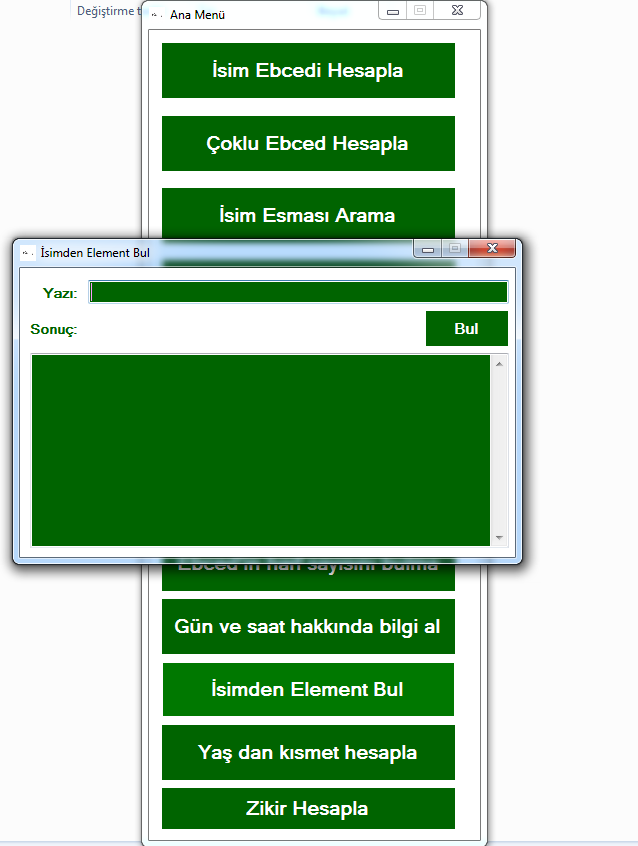

EbcedTurkishAlphabet

A칞캼l캼:

Baz캼 i륿emler:

K캼sa tan캼t캼m:

Bu program dinimiz 캻sl칙m i칞in haz캼rlad캼캼m programd캼r. 
Maksat Kur'an Kerim azim칲르n캼 ve Allahute칙l칙'n캼n bizim i칞in bah른tti를 isimlerle ve hikmetli kel칙mullahlar캼 daha derinlemesine incelemek i칞in yap캼lan bir ara칞t캼r. 
캻stenirse diye ufak bir vefk haz캼rlama koydum 칞ok basittir Allahute칙l칙'n캼n g칲zel isimlerinin se칞ilen bir tanesini 7 kere yazmaktad캼r.
Bize tecellisi 칞ok faidelidir.
Bu program캼 s칬z칲n cifir ebced de daha derinlemesine arayanlar i칞in ve z칙t캼m i칞in haz캼rlad캼m.
Rabbim bu yoldan bizi ay캼rmas캼n in르llah 游꺛

Ebced i칞in T칲rk칞e alfabe den istifade edilmi릆ir.
칂칲nk칲 Arap칞a biraz s캼k캼nt캼l캼 oldu릇 i칞in onu bir sonraki 칞al캼릀am da yapmay캼 d칲칲n칲yorum Rabbim ihs칙n ederse in르llah.

Niyet ve duam:

Az yukar캼da durumu izah ettim. 
E른r bu program캼 para veya telif haklar캼na uymadan kim kullan캼r de를릆irir ise veya k칬t칲 ama칞 i칞in kullan캼rsa:
Rabbim onu hem bu d칲nya da hem de 칙hiret zaman캼n da hi칞 bir kuluna vermedi를 azap cezas캼na 칞arpt캼rs캼n.
캻yi 칙mel etmeyen den ben sorumlu de를lim 칞칲nk칲 maksad캼m bellidir.

E른r bu program캼 her kim iyi 칙mel i륿emek i칞in kullan캼r veya telif haklar캼na g칬re geli릆irirse ve amac캼ndan sapt캼r캼lmassa rabbim 2 cih칙nda Muhammed, Mustafa, Ahmed resul'u ona 른f칙at칞i k캼ls캼n in르llah 游꺛
